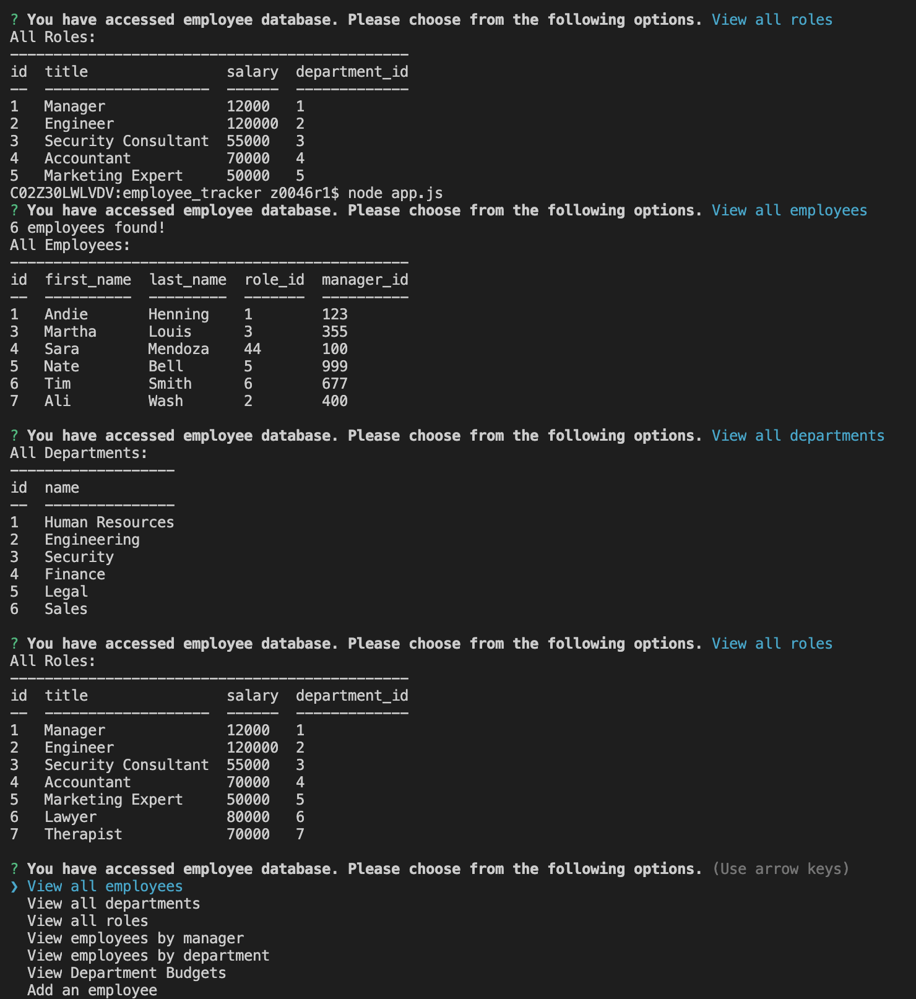
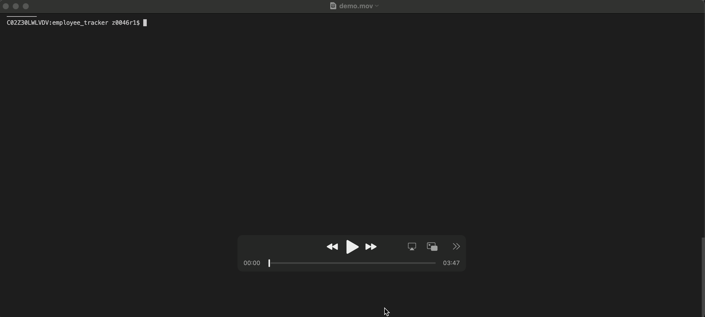

# Employee Tracker
This is a command-line application to manage a company's employee database, using Node.js, Inquirer, and MySQL.

         <br> 
## User Story
As a business owner, the user wants to view and manage the departments, roles, and employees in their company, so that they can organize and plan their business.

## Table of Contents 
1. [About the Project](#About-The-Project)
1. [Project Links](#Project-Links)
1. [Screenshots](#Screenshots)
1. [Demo](#Demo)
1. [Installation](#Installation)
1. [Contribution Guidelines](#Contribution-Guidelines)
1. [Project Team](#Project-Team)
1. [Questions](#Questions)
1. [License](#License)

## About The Project
This is a command-line application which accepts user input.
When the user starts the application, then they are presented with the following options: 
- View all departments: user is presented with a formatted table showing department names and department ids.
- View all roles: user is presented with the job title, role id, the department that role belongs to, and the salary for that role.
- View all employees: presented with a formatted table showing employee data, including employee ids, first names, last names, job titles, departments, salaries, and managers that the employees report to.
- Add a department: user is prompted to enter the name of the department and that department is added to the database. 
- Add a role: user is prompted to enter the name, salary, and department for the role and that role is added to the database.
- Add an employee: user is prompted to enter the employee’s first name, last name, role, and manager, and that employee is added to the database.
- And update an employee role: user is prompted to select an employee to update and their new role and this information is updated in the database.

## Project Links
[Repo Link](https://github.com/SepidehAyani/employee_tracker) <br>

## Screenshots


## Demo
[](assets/img/demo.mov)

## Instructions
```  
git clone https://github.com/SepidehAyani/employee_tracker.git
```
follow [this](https://flaviocopes.com/mysql-how-to-install/) to install MySql and setup your own username & password

#### Languages and libraries used in this project:
- <a href="https://www.npmjs.com/">NPM</a>
- <a href="https://nodejs.org/">Node.js</a>
- <a href="https://www.mysql.com/">MySQL</a>
- <a href="https://www.npmjs.com/package/express">Express.js</a>
- <a href="https://www.npmjs.com/package/inquirer">Inquirer.js</a>
- <a href="https://getbootstrap.com/">Bootstrap</a>

#### Contribution Guidelines:
```  
Feel free to contribute to this repo by creating issues or sending an email to sepid.ayani@gmail.com
```

## Questions
<details>
    <summary>Contact</summary>
    sepid.ayani@gmail.com
</details>

## Project Team
[SepidehAyani](https://github.com/SepidehAyani) <br>

## License
#### Distributed under the MIT License. See [Choose A License](https://choosealicense.com/) for more details.